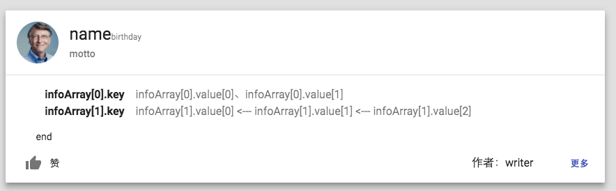

# 励志的程序员：
产品网址：
- http://inspiring.verygood123.com/inspiring-coder
- https://vectorzeng.github.io/inspiring-coder


如果你懂json语法，会使用github，那么快加入成为作者吧。让更多的人知道你喜欢的程序员。
只要把你希望系统录入的"程序员"的信息以json格式添加到文件[src/inspiring_coder.json](./src/inspiring_coder.json)。
他的头像统一放到[public/img](./public/img)。

修改好后给我[pull request](https://github.com/vectorzeng/inspiring-coder/pulls)吧，我会很开心很乐意的。

json结构：
``` javascript

{
  "id": n,/**自然数，自增即可**/
  "name": "姓名",
  "avatar": "img/6_billgates.jpg",//头像图片的地址，统一放在文件夹下： ./public/img/
  "birthday": "出生年月日",
  "motto": "座右铭，或者一句能形象描述该程序员的话，亦或者作者说过的一句话",
  "infoArray": [//关于该程序员的的信息数组
    {
      "key": "infoArray[0].key",
      "values": [
        "infoArray[0].value[0]",
        "infoArray[0].value[1]"
      ],
      "separator": "、"
    },
    {
      "key": "infoArray[1].key",
      "values": [
        "infoArray[1].value[0]",
        "infoArray[1].value[1]",
        "infoArray[1].value[2]"
      ]
    }
  ],
  "end": "结尾",
  "writer": "作者的名字",
  "url": "《更多》按钮跳转的链接地址",
  "writerUrl": "点击《作者名字》跳转的链接地址",
  "numOfLike": 赞数
}
```



<br/><br/>
如果你想添加后，查看效果:
(不想这么麻烦的话，直接pull request 我会帮你检查效果，以及语法)
- 安装nodejs
- 切换到分支：zl/check
- 修改文件[src/inspiring_coder.json](./src/inspiring_coder.json)
- 执行如下命令：
``` shell
npm install
npm start
```


